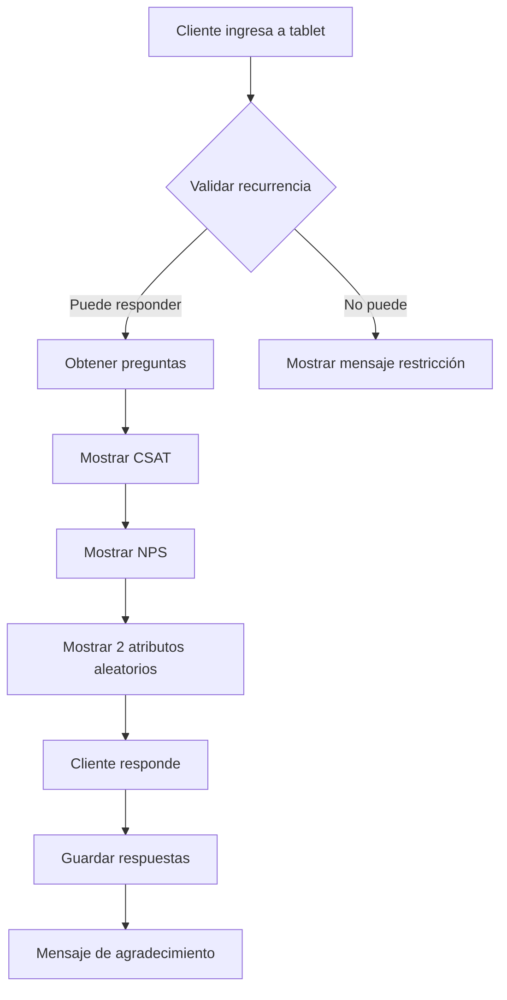

# Documentación del Sistema de Satisfacción del Cliente

## Índice
1. [Introducción](#introducción)
2. [Arquitectura del Sistema](#arquitectura-del-sistema)
3. [Diagramas PlantUML](#diagramas-plantuml)
4. [Componentes Principales](#componentes-principales)
5. [Base de Datos](#base-de-datos)
6. [Flujos de Trabajo](#flujos-de-trabajo)
7. [Configuración](#configuración)

---

## Introducción

El **Sistema de Satisfacción del Cliente** es un módulo del sistema IAS que permite configurar, administrar y analizar la experiencia del cliente en las salas mediante encuestas de satisfacción.

### Características Principales

- **Indicadores de Satisfacción**: CSAT, NPS y atributos personalizados
- **Configuración Flexible**: Preguntas programables por rango de fechas
- **Preguntas Aleatorias**: Selección automática de preguntas atributo
- **Control de Recurrencia**: Limita cuántas veces un cliente puede responder
- **Reportes Avanzados**: Comparación de periodos, tendencias y análisis detallado
- **Gestión de Tablets**: Control de dispositivos por sala
- **Exportación a Excel**: Generación de reportes en formato Excel

---

## Arquitectura del Sistema

El sistema sigue una arquitectura en capas:

```
???????????????????????????????????????
?   CapaPresentacion (Controllers)    ?  ? ASP.NET MVC
???????????????????????????????????????
?   CapaNegocio (BL - Business Logic) ?  ? Lógica de negocio
???????????????????????????????????????
?   CapaDatos (DAL - Data Access)     ?  ? Acceso a datos
???????????????????????????????????????
?   CapaEntidad (Entities & DTOs)     ?  ? Modelos de datos
???????????????????????????????????????
            ?
            ?
    ?????????????????
    ?   SQL Server  ?
    ?????????????????
```

### Proyectos Involucrados

- **CapaPresentacion**: Controladores MVC y vistas
- **CapaNegocio**: Lógica de negocio (BL)
- **CapaDatos**: Acceso a datos (DAL)
- **CapaEntidad**: Entidades y DTOs
- **S3k.Utilitario**: Utilidades compartidas

---

## Diagramas PlantUML

### Cómo usar los diagramas

Los diagramas están en formato PlantUML (`.puml`) y pueden ser visualizados usando:

1. **Visual Studio Code** con la extensión "PlantUML"
2. **Online**: [PlantText.com](https://www.planttext.com/) o [PlantUML Online Server](http://www.plantuml.com/plantuml/uml/)
3. **IntelliJ IDEA** con el plugin PlantUML
4. **Generador local**: Instalando PlantUML y Java

### Lista de Diagramas

| Archivo | Descripción |
|---------|-------------|
| `01_casos_de_uso.puml` | Diagrama de casos de uso del sistema |
| `02_diagrama_clases.puml` | Diagrama de clases con arquitectura completa |
| `03_secuencia_responder_encuesta.puml` | Flujo de cliente respondiendo encuesta |
| `04_secuencia_reporte_nps.puml` | Generación de reporte NPS |
| `05_secuencia_reporte_csat.puml` | Generación de reporte CSAT |
| `06_secuencia_reporte_atributos.puml` | Generación de reporte de atributos |
| `07_secuencia_configurar_pregunta_atributo.puml` | Configuración de preguntas personalizadas |
| `08_secuencia_configurar_tablets.puml` | Gestión de tablets por sala |
| `09_secuencia_exportar_excel.puml` | Exportación de datos a Excel |

---

## Componentes Principales

### 1. Controladores (Controllers)

#### ConfigClienteSatisfaccionController
**Ubicación**: `CapaPresentacion/Controllers/ClienteSatisfaccion/`

**Responsabilidades**:
- Gestión de preguntas (CSAT, NPS, Atributo)
- Configuración de tablets
- Generación de reportes
- Exportación a Excel
- Gestión de opciones

**Métodos principales**:
- `DataReportesEncuestaCSAT()`: Reporte CSAT con comparación de periodos
- `DataNPS()`: Reporte NPS con clasificación de clientes
- `DataIndicador()`: Reporte de atributos personalizados
- `CrearPreguntaAtributo()`: Crear nueva pregunta atributo
- `ExportarEncuestasExcel()`: Exportar datos a Excel

#### EscReportesController
**Ubicación**: `CapaPresentacion/Controllers/SatisfaccionCliente/`

**Responsabilidades**:
- Reportes del módulo antiguo (ESC)
- Generación de Excel para respuestas

#### EscRespuestasController
**Responsabilidades**:
- Obtener respuestas por sala
- Insertar nuevas respuestas

### 2. Capa de Negocio (BL)

#### RespuestaBL
**Ubicación**: `CapaNegocio/ClienteSatisfaccion/Respuesta/`

**Métodos clave**:
```csharp
// NPS
NpsResultadoDTO ObtenerNPSIndicador(DateTime fechaInicio, DateTime fechaFin)
List<NpsMensualDTO> ObtenerNPSMensual(DateTime fechaInicio, DateTime fechaFin)
List<NpsRespuestaDTO> ObtenerNPSRespuestas(DateTime fechaInicio, DateTime fechaFin, int salaId)

// CSAT
CsatResultadoDTO ObtenerCSATIndicador(DateTime fechaInicio, DateTime fechaFin, int salaId)
List<CsatDiarioDTO> ObtenerCSATDiario(DateTime fechaInicio, DateTime fechaFin, int salaId)

// Atributos
IndicadorResultadoDTO ObtenerIndicador(string indicador, DateTime fechaInicio, DateTime fechaFin)
List<IndicadorDiarioDTO> ObtenerIndicadorDiario(DateTime fechaInicio, DateTime fechaFin, string indicador)

// Comentarios
List<EncuestadoDTO> ObtenerEncuestados(int salaId, DateTime fechaInicio, DateTime fechaFin)
List<RespuestaAtributoDTO> ObtenerRespuestasAtributos(int salaId, DateTime fechaInicio, DateTime fechaFin)
```

#### PreguntasBL
**Métodos**:
- `ListadoPreguntas(int tipoEncuesta)`
- `CrearPregunta(PreguntaEntidad pregunta)`
- `EditarPregunta(PreguntaEntidad pregunta)`
- `TogglePregunta(int idPregunta)`
- `ObtenerPreguntasAtributo()`

#### TabletBL
**Métodos**:
- `ListadoTablets(int salaId)`
- `CrearTablet(TabletEntidad tablet)`
- `EditarTablet(string nombre, bool activa, int idTablet)`

### 3. Capa de Datos (DAL)

#### RespuestaDAL
**Ubicación**: `CapaDatos/ClienteSatisfaccion/Respuesta/`

**Consultas SQL importantes**:

##### Cálculo de NPS
```sql
SELECT 
    COUNT(*) AS TotalRespuestas,
    SUM(CASE WHEN o.Valor IN (1,2) THEN 1 ELSE 0 END) AS CantDetractores,
    SUM(CASE WHEN o.Valor IN (3,4) THEN 1 ELSE 0 END) AS CantPasivos,
    SUM(CASE WHEN o.Valor = 5 THEN 1 ELSE 0 END) AS CantPromotores,
    
    CAST(ROUND(
        (CAST(SUM(CASE WHEN o.Valor = 5 THEN 1 ELSE 0 END) * 100.0 / NULLIF(COUNT(*),0) AS FLOAT))
      - (CAST(SUM(CASE WHEN o.Valor IN (1,2) THEN 1 ELSE 0 END) * 100.0 / NULLIF(COUNT(*),0) AS FLOAT))
    , 0) AS INT) AS NPS
FROM RespuestaPregunta rp
INNER JOIN Opcion o ON rp.IdOpcion = o.IdOpcion
INNER JOIN Pregunta p ON rp.IdPregunta = p.IdPregunta
INNER JOIN RespuestaEncuesta re ON rp.IdRespuestaEncuesta = re.IdRespuestaEncuesta
WHERE p.Indicador = 'NPS'
```

##### Cálculo de CSAT
```sql
SELECT 
    COUNT(*) AS TotalRespuestas,
    ROUND(CAST(SUM(CASE WHEN o.Valor IN (4,5) THEN 1 ELSE 0 END) * 100.0 / NULLIF(COUNT(*),0) AS DECIMAL(5,2)),2) AS CSAT
FROM RespuestaPregunta rp
WHERE p.Indicador = 'CSAT'
```

---

## Base de Datos

### Tablas Principales

#### Pregunta
```sql
CREATE TABLE Pregunta (
    IdPregunta INT PRIMARY KEY IDENTITY,
    IdTipoEncuesta INT,
    Texto NVARCHAR(500),
    Indicador NVARCHAR(50),  -- 'NPS', 'CSAT', 'LIMPIEZA', etc.
    Orden INT,
    Random BIT,
    Multi BIT,
    Activo BIT,
    FechaInicio DATETIME,
    FechaFin DATETIME
)
```

#### Opcion
```sql
CREATE TABLE Opcion (
    IdOpcion INT PRIMARY KEY IDENTITY,
    IdPregunta INT FOREIGN KEY REFERENCES Pregunta(IdPregunta),
    Texto NVARCHAR(200),
    TieneComentario BIT,
    Valor INT  -- 1 a 5 para escalas
)
```

#### RespuestaEncuesta
```sql
CREATE TABLE RespuestaEncuesta (
    IdRespuestaEncuesta INT PRIMARY KEY IDENTITY,
    IdSala INT,
    IdTablet INT,
    NroDocumento NVARCHAR(20),
    TipoDocumento NVARCHAR(10),
    FechaRespuesta DATETIME,
    IdTipoEncuesta INT,
    Nombre NVARCHAR(200),
    Correo NVARCHAR(100),
    Celular NVARCHAR(20)
)
```

#### RespuestaPregunta
```sql
CREATE TABLE RespuestaPregunta (
    IdRespuestaPregunta INT PRIMARY KEY IDENTITY,
    IdRespuestaEncuesta INT FOREIGN KEY REFERENCES RespuestaEncuesta(IdRespuestaEncuesta),
    IdPregunta INT FOREIGN KEY REFERENCES Pregunta(IdPregunta),
    IdOpcion INT FOREIGN KEY REFERENCES Opcion(IdOpcion),
    Comentario NVARCHAR(1000)
)
```

#### Tablet
```sql
CREATE TABLE Tablet (
    IdTablet INT PRIMARY KEY IDENTITY,
    IdSala INT,
    Nombre NVARCHAR(100),
    Activa BIT
)
```

---

## Flujos de Trabajo

### 1. Cliente Responde Encuesta



### 2. Generación de Reporte NPS

1. **Entrada**: fechaInicio, fechaFin, salaId
2. **Proceso**:
   - Calcular periodo anterior
   - Obtener respuestas NPS de ambos periodos
   - Clasificar clientes (Detractores, Pasivos, Promotores)
   - Calcular porcentajes y NPS
   - Calcular deltas y tendencias
3. **Salida**: Dashboard con gráficos y métricas

### 3. Configuración de Pregunta Atributo

1. **Entrada**: Texto, Indicador, FechaInicio, FechaFin
2. **Validación**: Indicador único
3. **Creación**: 
   - Insertar pregunta
   - Crear 5 opciones estándar automáticamente
4. **Resultado**: Pregunta disponible para encuestas

---

## Configuración

### Indicadores Disponibles

| Indicador | Descripción | Tipo |
|-----------|-------------|------|
| CSAT | Customer Satisfaction Score | Obligatorio |
| NPS | Net Promoter Score | Obligatorio |
| LIMPIEZA | Satisfacción con limpieza | Atributo |
| ATENCION | Calidad de atención | Atributo |
| SEGURIDAD | Percepción de seguridad | Atributo |
| ... | Otros personalizados | Atributo |

### Valores de Respuesta

| Valor | Texto | Uso |
|-------|-------|-----|
| 1 | Muy insatisfecho | Detractor (NPS 1-2) |
| 2 | Insatisfecho | Detractor (NPS 1-2) |
| 3 | Neutral | Pasivo (NPS 3-4) |
| 4 | Satisfecho | Pasivo/Promotor (NPS 3-4) |
| 5 | Muy satisfecho | Promotor (NPS 5) |

### Fórmulas de Cálculo

#### NPS (Net Promoter Score)
```
NPS = % Promotores - % Detractores

Donde:
- Promotores: Valor = 5
- Pasivos: Valor = 3 o 4
- Detractores: Valor = 1 o 2
```

#### CSAT (Customer Satisfaction Score)
```
CSAT = (Satisfechos + Muy Satisfechos) / Total * 100

Donde:
- Satisfechos: Valor = 4
- Muy Satisfechos: Valor = 5
```

#### Indicador Atributo
```
Indicador = % Muy Satisfecho - % Muy Insatisfecho

Rango: -100 a +100
- Positivo: Más satisfacción
- Negativo: Más insatisfacción
- Cero: Equilibrio
```

---

## Rutas de Controladores

### Reportes
- `POST /ConfigClienteSatisfaccion/DataNPS` - Reporte NPS
- `POST /ConfigClienteSatisfaccion/DataNCSAT` - Reporte CSAT
- `POST /ConfigClienteSatisfaccion/DataIndicador` - Reporte Atributo

### Configuración
- `POST /ConfigClienteSatisfaccion/ObtenerPreguntas` - Listar preguntas
- `POST /ConfigClienteSatisfaccion/CrearPreguntaAtributo` - Crear pregunta
- `POST /ConfigClienteSatisfaccion/EditarPregunta` - Editar pregunta
- `POST /ConfigClienteSatisfaccion/TogglePregunta` - Activar/Desactivar

### Tablets
- `POST /ConfigClienteSatisfaccion/ObtenerTabletsSala` - Listar tablets
- `POST /ConfigClienteSatisfaccion/CrearTablet` - Crear tablet
- `POST /ConfigClienteSatisfaccion/EditarTablet` - Editar tablet

### Exportación
- `POST /ConfigClienteSatisfaccion/ExportarEncuestasExcel` - Exportar a Excel

---

## Tecnologías Utilizadas

- **Backend**: ASP.NET MVC (.NET Framework 4.6.1)
- **Base de Datos**: SQL Server
- **ORM**: ADO.NET (SqlConnection, SqlCommand)
- **Excel**: EPPlus (Non-Commercial License)
- **Frontend**: JavaScript, jQuery, Bootstrap
- **Gráficos**: Chart.js

---

## Notas Adicionales

### Selección Aleatoria de Preguntas
- Se muestran 2 preguntas atributo aleatorias por encuesta
- Solo se consideran preguntas activas
- Deben estar dentro del rango de fechas configurado

### Control de Recurrencia
- Configurable por sala
- Opciones: 1 respuesta por día o sin límite
- Validación por número de documento

### Comparación de Periodos
- Automática: calcula periodo anterior con la misma duración
- Muestra deltas y tendencias
- Permite identificar mejoras o deterioros

---

## Contacto y Soporte

Para más información sobre el sistema, contactar al equipo de desarrollo.

**Fecha de documentación**: Mayo 2024  
**Versión del sistema**: 1.0
